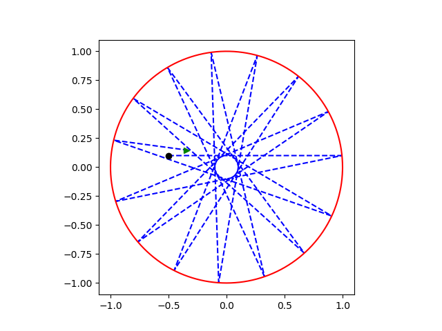

# Bilard

Napisz program symulujący „bilard na kółku". Dokładniej: wewnątrz koła jednostkowego na płaszczyźnie porusza się cząstka (punkt), zachowując stałą prędkość — dopóki nie napotka brzegu, czyli okręgu; wówczas odbija się zgodnie z zasadą, że kąt padania równa się kątowi odbicia (chodzi o kąt pomiędzy wektorem prędkości a promieniem okręgu jednostkowego w miejscu, gdzie tor ruchu przecina się z okręgiem), po odbiciu jest on taki sam co do wartości ale po drugiej stronie promienia. Program rysuje okręg jednostkowy oraz tor ruchu cząstki wewnątrz tego okręgu, w zależności od początkowego położenia, kierunku początkowej prędkości (wartość prędkości jest nieistotna, ponieważ jest stała) i czasu obserwacji.

Wynikiem programu powinien być wykres podobny do poniższego:

zarną kropką oznaczono położenie początkowe, a na zielono — końcowe.
